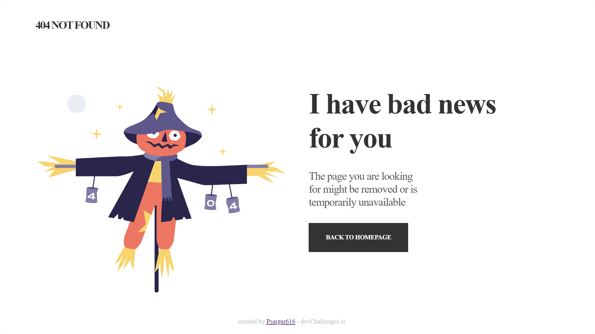

<!-- Please update value in the {}  -->

<h1 align="center">{Page 404 Not Found}</h1>

   Solution for a challenge from  <a href="http://devchallenges.io" target="_blank">Devchallenges.io</a>.

  <h3>
    <a href="https://{psargar616.github.io/404-not-found-master/}">
      Demo
    </a>
     | 
    <a href="https://{github.com/Psargar616/404-not-found-master/settings/pages}">
  
      Solution
    </a>
     | 
    <a href="https://devchallenges.io/challenges/wBunSb7FPrIepJZAg0sY">
      Challenge
    </a>
  </h3>

<!-- TABLE OF CONTENTS -->

## Table of Contents

- [Overview](#overview)
  - [Built With](#built-with)
- [Features](#features)
- [Contact](#contact)

<!-- OVERVIEW -->

## Overview

Created a '404 not found page' by following the design from devchallenges.io using HTML and CSS

- Solution :[GitHub](https://github.com/Psargar616/404-not-found-master/settings/pages)
- Live URL : [404 not found page](https://psargar616.github.io/404-not-found-master/)

### Built With

<!-- This section should list any major frameworks that you built your project using. Here are a few examples.-->

- HTML
- CSS

## Features

<!-- List the features of your application or follow the template. Don't share the figma file here :) -->

This application/site was created as a submission to a [DevChallenges](https://devchallenges.io/challenges) challenge. The [challenge](https://devchallenges.io/challenges/wBunSb7FPrIepJZAg0sY) was to build an application to complete the given user stories.

## Contact

- GitHub [@your-username](https://{github.com/Psargar616})

